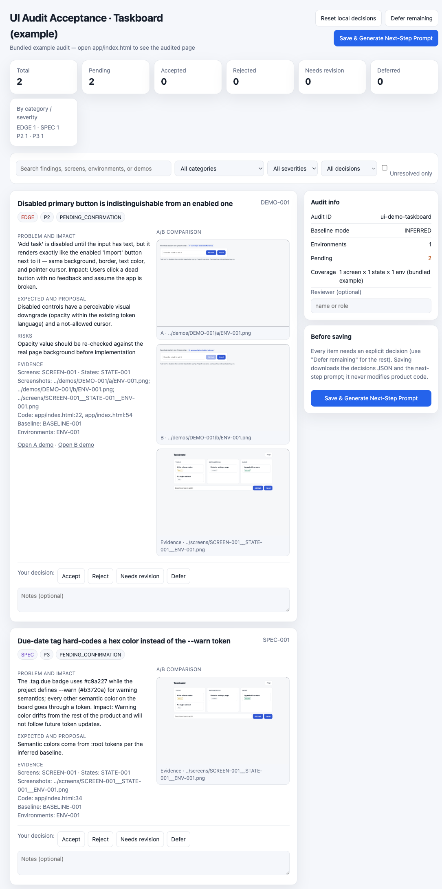

# ui-check

**证据优先的 UI 对齐审计 Agent Skill。**

[](LICENSE)

[English](README.md) | 简体中文

`ui-check` 教会 AI 编码代理(Claude Code、Cursor、Codex 或任何兼容 [Agent Skills](https://agentskills.io) 的运行时)执行一次有纪律的 UI 走查:清点每个界面和用户可见状态、捕获真实渲染截图、以项目**自身**的设计标准为准绳评判对齐度,最后交给用户一份交互式验收包逐项批准或拒绝——全程不改动产品代码。



*上图即仓库自带的示例——用浏览器打开 [`examples/demo-audit/acceptance/ui-acceptance.html`](examples/demo-audit/acceptance/ui-acceptance.html) 即可亲手体验决策流程。*

## 为什么需要它

直接让代理"看看我的 UI 有什么问题",得到的往往是一堆口味化意见,外加一次按模型本月审美的重设计。`ui-check` 用五条纪律取而代之:

1. **项目自身即设计权威。** skill 先发现项目的显式或隐含 UI 标准(`EXPLICIT` / `HYBRID` / `INFERRED` / `ABSENT`),再以它为准绳评判——绝不引入外来的视觉语言。同时保留一条独立于内部基线的无障碍底线(对比度、焦点可见性、触控目标)。
2. **没有证据就不算数。** 每条结论都关联真实渲染截图和 `file:line` 代码定位;视觉疑点必须先用 DOM 度量验证才能立案;机器校验器核查每个被引用的产物文件真实存在。
3. **类型化发现,拒绝含糊。** 每条发现归入 `SPEC`(违反标准)、`POLISH`(低于项目成熟水准)、`EDGE`(可复现缺陷)、`OPT`(标准内改进)或 `SPEC_CHANGE_REQUIRED`(需要新设计规则——单独标记,必须由用户显式裁决)。
4. **声明式覆盖,拒绝假穷举。** 审计先声明覆盖计划(关键界面 × 完整环境矩阵,其余界面 × 默认环境 + 一个对照环境),配合效力分档(`QUICK` / `STANDARD` / `EXHAUSTIVE`),让诚实的审计真正能够完成——没覆盖到的如实记录,而不是被掩盖。
5. **用户决策,代理止步。** 提案以 A/B 证据形式进入交互式 HTML 验收包;决策导出为 `decisions.json` 和下一任务的续接 prompt。审计任务永不修改产品源码。

## 它是什么(不是什么)

它是一次性的、证据纪律化的**审计**,为生活在 agent 工作流中的项目而生——尤其是没有设计团队的项目。它**不是**:

- CI 视觉回归工具(Percy/Chromatic 与已批准的上一版构建对比;ui-check 与项目自身的内部标准对比——两者互补,审计截图正好可以作为回归基线的初始素材);
- WCAG 扫描器(axe 自动化规则可查的无障碍项;ui-check 保留一条小的人工无障碍底线,并欢迎把 axe 输出作为证据);
- 设计师品味判断的替代品。skill 保证的是**过程诚实**——声明式覆盖、真实截图、可验证的断言、不编造结果;**发现的质量仍取决于执行它的模型**。

成本预期:`QUICK` 单页检查是分钟级;中型应用的 `STANDARD` 审计需要数小时的 agent 运行时间,可能跨会话(skill 支持断点续跑)。skill 要求 agent 在开始前向你预告预期投入。

## 你会得到什么

一次审计产出一个隔离工作区(默认 `work/ui-check/<audit-id>/`):

```
audit-manifest.json          # 机器可读账本:范围、基线、覆盖计划、
                             # 清单、证据、发现、demo、评审、决策
reports/ui-standard.md       # 项目 UI 基线及其来源
reports/audit-report.md      # 覆盖率、发现、未知项、风险
screens/                     # 真实渲染截图(SCREEN × STATE × ENV)
fixtures/                    # 走查过程使用的安全 mock 数据
demos/                       # 使用 mock 数据的隔离 A/B 证据
acceptance/ui-acceptance.html    # 交互式决策界面(自包含、可离线)
acceptance/decisions.json        # 你保存的决策(由 HTML 导出)
acceptance/continuation-prompt.md# 给实施任务的现成 prompt
```

验收 HTML 可离线使用,支持按类别/优先级/决策筛选、逐项接受/拒绝/需修改/延期并附备注、"延期其余项"以支持分次评审,以及唯一主操作——**Save & Generate Next-Step Prompt**——导出决策文件和续接 prompt,并明确指示下一个代理*只*实施被接受的项。

## 安装

Agent Skill 就是一个目录。把本仓库复制或克隆到运行时的 skills 位置:

| 运行时 | 个人级 | 项目级 |
|---|---|---|
| Claude Code | `~/.claude/skills/ui-check/` | `.claude/skills/ui-check/` |
| Cursor | `~/.cursor/skills/ui-check/` | `.cursor/skills/ui-check/` |
| Codex | `~/.agents/skills/ui-check/` | `.agents/skills/ui-check/` |

`.agents/skills/` 是 Codex 与 Cursor 共同支持的跨工具路径;Codex 旧版的 `~/.codex/skills/` 仍然兼容。

```bash
git clone https://github.com/Octo-o-o-o/ui-check ~/.claude/skills/ui-check
```

环境要求:Python 3.8+(仅标准库——脚本在 macOS / Linux / Windows 均可运行;macOS/Linux 上用 `python3` 调用,Windows 上用 `python`),以及代理可用的浏览器 / computer-use / 移动模拟器工具(用于真实渲染取证)。

## 使用

自然触发即可——"跑一次 UI 审计"、"做一轮 design QA"、"发布前查一下 UI 一致性"——也可以显式调用(Claude Code 中 `/ui-check`,Codex 中 `$ui-check`)。范围和投入随请求缩放:

- *"快速看一眼设置页的 UI"* → `QUICK` 档:默认环境,发现清单 + 截图,不做 demo(想要交互式验收包请用 `STANDARD` 档)。
- *"审计整个应用的 UI"* → `STANDARD` 档:声明覆盖计划、A/B 证据、完整验收包。
- *"穷举所有主题和断点,时间不限"* → `EXHAUSTIVE` 档。

工作流(详见 [SKILL.md](SKILL.md)):保护工作区 → 建立 UI 基线 → 清点界面/状态/环境并声明覆盖计划 → 真实走查截图 → 分类发现 → 独立评审 → A/B 证据 → 交互式验收 → 在实施前停止。

## 内置工具

| 脚本 | 用途 |
|---|---|
| `scripts/init_audit.py` | 搭建审计工作区和最小 manifest |
| `scripts/validate_audit_manifest.py` | 机器校验 ID、引用、枚举、决策,以及每个被引用的截图/demo 文件是否存在 |
| `scripts/build_acceptance_demo.py` | 把 manifest 编译成自包含的验收 HTML |

所有脚本均为纯标准库 Python 3,报错信息清晰;验收模板(`assets/acceptance-demo-template.html`)是单个零依赖 HTML 文件。

## 仓库结构

```
SKILL.md                     # skill 入口(frontmatter + 工作流)
references/                  # 渐进披露文档,代理按需加载
  audit-schema.md            #   manifest / 证据 / 发现 / demo / 决策 schema
  platform-matrix.md         #   工具路由、环境维度、覆盖计划规则
  visual-review.md           #   评审量规、分类纪律、无障碍底线
  acceptance-protocol.md     #   验收 HTML 行为与决策流程
scripts/                     # 可执行辅助脚本(见上表)
tests/                       # 校验器单元测试
assets/                      # 验收 HTML 模板(用于产出物,不进入上下文)
examples/demo-audit/         # 完整示例审计,含可直接打开的验收包
agents/openai.yaml           # Codex 可选的 UI 元数据;其他运行时会忽略
docs/                        # README 配图
```

## 许可证

[MIT](LICENSE)
